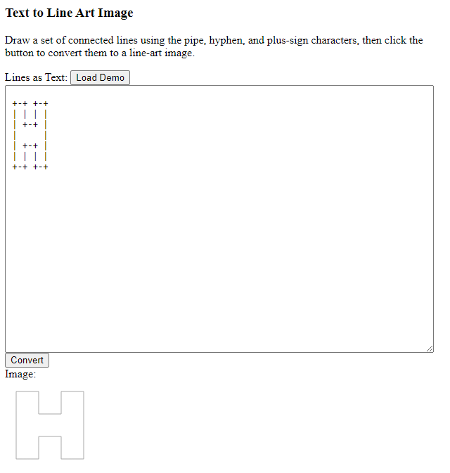

Text to Line Art Image Converter
================================

Draw a set of connected lines using the pipe, hyphen, and plus-sign characters,
then click the button to convert them to a line-art image.

